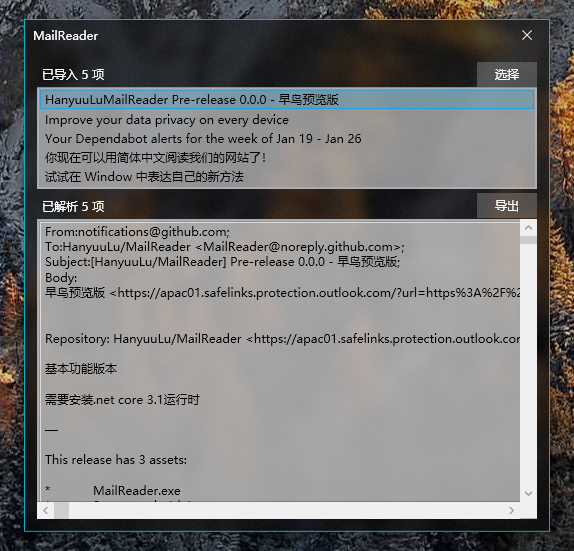

# 邮件阅读机

将Microsoft Outlook的eml文件或者msg文件批量读入并导出为json文件的小工具。

> 项目处于早期阶段、各种功能还不完善和健壮，如有意见和想法欢迎致信。

> 为了减小传输体积，我们使用了基于运行时的发布版本，如果您的电脑提示无法运行，请下载一个[.NET Desktop Runtime](https://dotnet.microsoft.com/download/dotnet/5.0)再运行程序。

